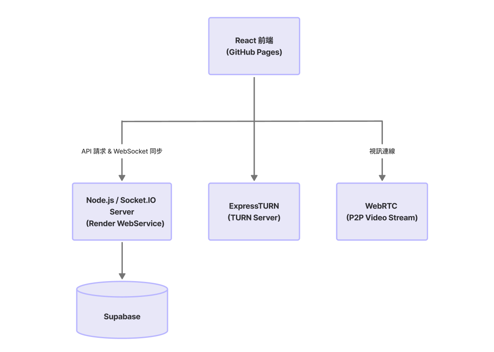
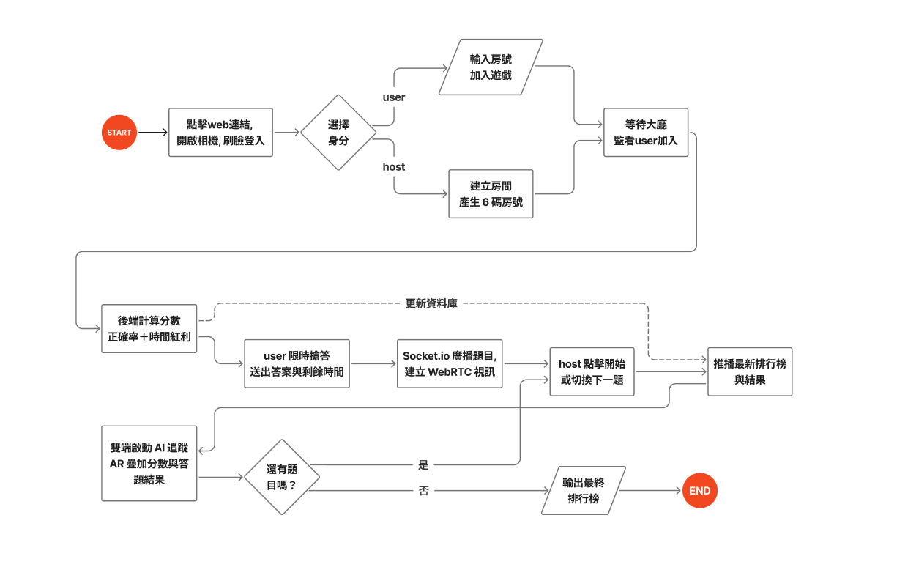

<div align="center">

# AR Vision Link
### Interactive AR Quiz Platform

即時多人互動測驗平台 × AR 即時資訊顯示 × 智慧教室應用

**Frontend & Build**
<br>


**AI & Real-Time (Core)**
<br>


**Backend & Database**
<br>


**Status & License**
<br>


</div>

---

# 專案簡介

AR Vision Link 是一套結合 擴增實境（AR）、WebRTC 即時視訊串流、多人線上測驗系統 與 人臉辨識技術 的互動式學習平台。

玩家可透過手機或電腦參與測驗，系統會於玩家畫面中顯示 AR 分數與作答狀態，而主持人則可透過中控台即時監控所有玩家的測驗進度、作答情況與視訊畫面。本系統以提升線上學習互動性為目標，融合 Kahoot 類型競賽機制與 AR 技術，打造更具沉浸感的學習體驗。

---

# 系統特色

### 🎮 多人即時互動測驗
- 建立與管理測驗題庫
- 多人即時加入房間與作答同步
- 倒數計時與自動計分系統
- 即時排行榜動態更新

### 🥽 AR 即時資訊顯示
- 玩家頭頂顯示即時分數與答題結果
- 玩家頭頂顯示排名資訊與連勝紀錄
- 零延遲邊緣運算，隱私影像不上雲端

### 🎛 主持人控制台
- 網頁版上帝視角，監控全體玩家即時視訊
- 控制題目切換與遊戲進度
- 即時監控排行榜與單題作答統計

### 📊 學習分析
- 玩家表現/題目正確率分析
- 班級統計資料
- 測驗歷史紀錄

---

# 系統架構



---

# 技術架構

**Frontend (前端與視覺引擎)**
- React 18 / Vite / React Router
- TensorFlow.js / MediaPipe (邊緣 AI 運算)
- face-api.js (臉部特徵提取)

**Backend & Real-Time (後端與即時通訊)**
- Node.js / Express
- Socket.IO (狀態機與全域廣播)
- WebRTC / ExpressTURN (P2P 視訊直連)

**Database (資料庫)**
- Supabase (PostgreSQL)

---

# 系統流程



---

# 計分機制

系統採用動態紅利計分，答題越快分數越高：
**總分 = 基本分數 + 時間加成**

```text
基本分數 = 1000
時間加成 = 剩餘秒數 × 10

【範例】剩餘時間為 15 秒時正確作答：
1000 + (15 × 10) = 1150 分
```

---

# 資料庫設計

### `users` (使用者資料)
| 欄位名稱 | 型別 | 屬性 / 說明 |
| :--- | :--- | :--- |
| `id` | INT8 | **PRIMARY KEY** |
| `name` | VARCHAR | |
| `nickname` | VARCHAR | |
| `description` | TEXT | |
| `extra_info` | TEXT | |
| `is_active` | BOOLEAN | |
| `created_at` | TIMESTAMPTZ | |
| `updated_at` | TIMESTAMPTZ | |
| `face_embedding` | FLOAT8[] | AI 臉部特徵矩陣 |
| `avatar_url` | TEXT | |

### `quizzes` (測驗題庫)
| 欄位名稱 | 型別 | 屬性 / 說明 |
| :--- | :--- | :--- |
| `quiz_id` | INT8 | **PRIMARY KEY** |
| `host_id` | INT8 | FOREIGN KEY 參考 `users(id)` |
| `title` | VARCHAR | |
| `created_at` | TIMESTAMPTZ | |

### `questions` (測驗題目)
| 欄位名稱 | 型別 | 屬性 / 說明 |
| :--- | :--- | :--- |
| `question_id` | INT8 | **PRIMARY KEY** |
| `quiz_id` | INT8 | FOREIGN KEY 參考 `quizzes(quiz_id)` |
| `question_text` | TEXT | |
| `options` | JSONB | |
| `correct_answer` | VARCHAR | |
| `time_limit` | INT4 | |
| `created_at` | TIMESTAMPTZ | |

### `game_rooms` (遊戲房間)
| 欄位名稱 | 型別 | 屬性 / 說明 |
| :--- | :--- | :--- |
| `session_id` | INT8 | **PRIMARY KEY** |
| `quiz_id` | INT8 | FOREIGN KEY 參考 `quizzes(quiz_id)` |
| `room_code` | VARCHAR | 6 碼房間號碼 |
| `started_at` | TIMESTAMPTZ | |
| `ended_at` | TIMESTAMPTZ | |
| `current_question` | INT4 | |
| `game_finished` | BOOLEAN | |

### `player_records` (玩家總成績)
| 欄位名稱 | 型別 | 屬性 / 說明 |
| :--- | :--- | :--- |
| `record_id` | INT8 | **PRIMARY KEY** |
| `session_id` | INT8 | FOREIGN KEY 參考 `game_rooms(session_id)` |
| `user_id` | INT8 | FOREIGN KEY 參考 `users(id)` |
| `score` | INT4 | |
| `correct_count` | INT4 | |
| `rank` | INT4 | |
| `joined_at` | TIMESTAMPTZ | |

### `player_answers` (玩家單題作答紀錄)
| 欄位名稱 | 型別 | 屬性 / 說明 |
| :--- | :--- | :--- |
| `answer_id` | INT8 | **PRIMARY KEY** |
| `session_id` | INT8 | FOREIGN KEY 參考 `game_rooms(session_id)` |
| `question_id` | INT8 | FOREIGN KEY 參考 `questions(question_id)` |
| `user_id` | INT8 | FOREIGN KEY 參考 `users(id)` |
| `answer` | VARCHAR | |
| `is_correct` | BOOLEAN | |
| `score` | INT4 | |
| `answered_at` | TIMESTAMPTZ | |

---

# 專案結構

```text
AR-VISION-LINK/
├── ar-vision-link/
│   ├── backend/                        # Express & Socket.io 伺服器
│   │   ├── .gitignore
│   │   ├── package
│   │   └── server.js
│   │
│   ├── public/                         # 靜態資源與 WebAssembly 模型
│   │   ├── chest.png
│   │   ├── favicon.svg
│   │   ├── icon.svg
│   │   ├── tfjs-backend-wasm.wasm
│   │   ├── tfjs-backend-wasm-simd.wasm
│   │   └── tfjs-backend-wasm-threaded-simd.wasm
│   │   
│   ├── src/
│   │   ├── pages/
│   │   │   ├── Camera.jsx
│   │   │   ├── CreateQuiz.jsx
│   │   │   ├── EditProfile.jsx
│   │   │   ├── FaceLogin.jsx
│   │   │   ├── Home.jsx
│   │   │   ├── HostConsole.jsx
│   │   │   ├── HostLobby.jsx
│   │   │   ├── JoinQuiz.jsx
│   │   │   ├── Leaderboard.jsx
│   │   │   ├── ManageQuizzes.jsx
│   │   │   ├── Profile.jsx
│   │   │   ├── QuizGame.jsx
│   │   │   ├── QuizHome.jsx
│   │   │   ├── Register.jsx
│   │   │   ├── ReRwgisterFace.jsx
│   │   │   └── WaitingLobby.jsx
│   │   │
│   │   ├── components/
│   │   │   ├── Navbar.jsx
│   │   │   └── ProtectRoute.jsx
│   │   │
│   │   ├── styles/
│   │   │   ├── Camera.css
│   │   │   ├── CreateQuiz.css
│   │   │   ├── EditProfile.css
│   │   │   ├── FaceLogin.css
│   │   │   ├── Home.css
│   │   │   ├── HostConsole.css
│   │   │   ├── HostLobby.css
│   │   │   ├── JoinQuiz.css
│   │   │   ├── Leaderboard.css
│   │   │   ├── ManageQuizzes.css
│   │   │   ├── Profile.css
│   │   │   ├── QuizGame.css
│   │   │   ├── QuizHome.css
│   │   │   ├── Register.css
│   │   │   ├── ReRwgisterFace.css
│   │   │   └── WaitingLobby.css
│   │   │
│   │   ├── App.css
│   │   ├── App.jsx
│   │   ├── index.css
│   │   └── main.jsx
│   │   
│   ├── .gitignore
│   ├── eslint.config.js
│   ├── index.html
│   ├── package.json
│   ├── package-lock.json
│   ├── README.md
│   ├── readme.txt
│   └── vite.config.js
│
├── doc/                             # 系統相關文件與簡報    
│   ├── 專題_三上期末報告書(現已改為ARVisionLink).pdf
│   ├── 專題_設計文件書.pdf
│   ├── 專題_需求規格書(現已改為ARVisionLink).pdf
│   ├── 第一次上台簡報.pdf
│   └── 第二次上台簡報.pdf
│
├── Ignore
├── OLD_README.md
└── README.md
```

---

# 相關文件

本專案的相關文件皆存放於 [`doc/`](./doc/) 資料夾底下，歡迎查閱：
- 三上期末報告書
- 需求規格書
- 設計文件書
- 第1次上台簡報
- 第2次上台簡報

---

# 報告影片 & 專題demo

- 第2次上台簡報_錄影 (位於主目錄下方 .mp4 檔)

---

# 快速開始

### 🚀 線上體驗
可直接於 GitHub Pages 用瀏覽器執行：  
[https://b1229049.github.io/ar-vision-link/](https://b1229049.github.io/ar-vision-link/)

### 本地環境部署

**1. Clone Repository**
```bash
git clone [https://github.com/B1229049/ar-vision-link.git](https://github.com/B1229049/ar-vision-link.git)
cd ar-vision-link
```

**2. 安裝套件**
```bash
npm install
```

**3. 啟動開發環境**
你需要分別啟動前端與後端伺服器：

啟動前端 (Vite)：
```bash
npm run dev
```

啟動後端 (Node.js API & Socket.io)：
```bash
node backend/server.js
```

---

# 部署方式

- **Frontend:** GitHub Pages
- **Backend:** Render
- **Database:** Supabase PostgreSQL
- **WebRTC Infrastructure:** ExpressTURN (TURN Server)

---

# 未來發展

- **AI 功能:** AI 自動產題、題目推薦與個人化學習路徑分析。
- **AR 功能:** AR 排名特效展示、成就系統、小組任務模式。
- **教學功能:** 完善班級管理、課程成績匯出與學習歷程紀錄。

---

# 開發團隊

**長庚大學 資訊工程學系 三年級**
- B1229049 陳泓均
- B1229006 陳語嫻
- B1229021 黃星昊
- B1229031 黃柏瑞

---

# 授權聲明

本專案僅供教育、研究與學術展示用途。
